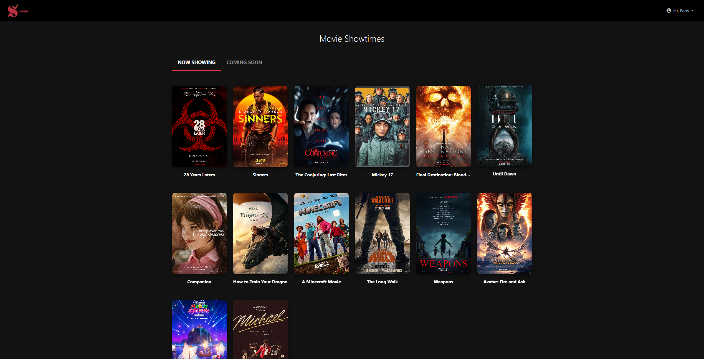
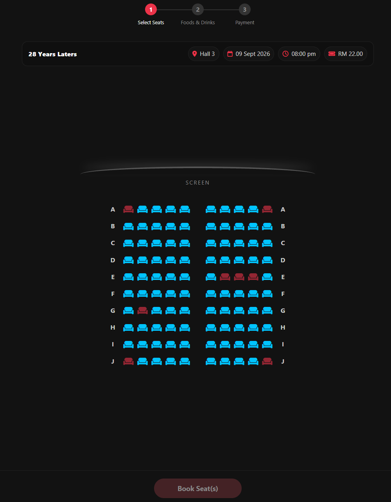
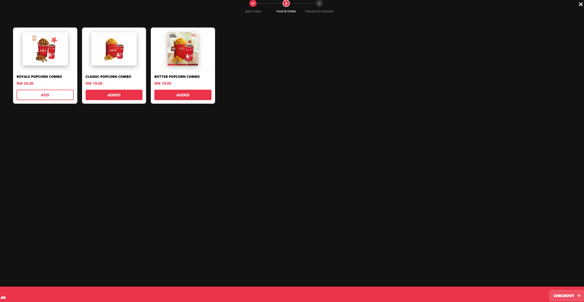
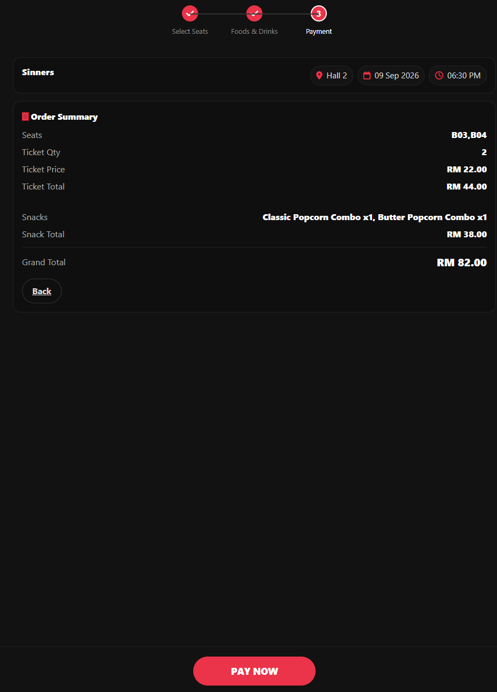
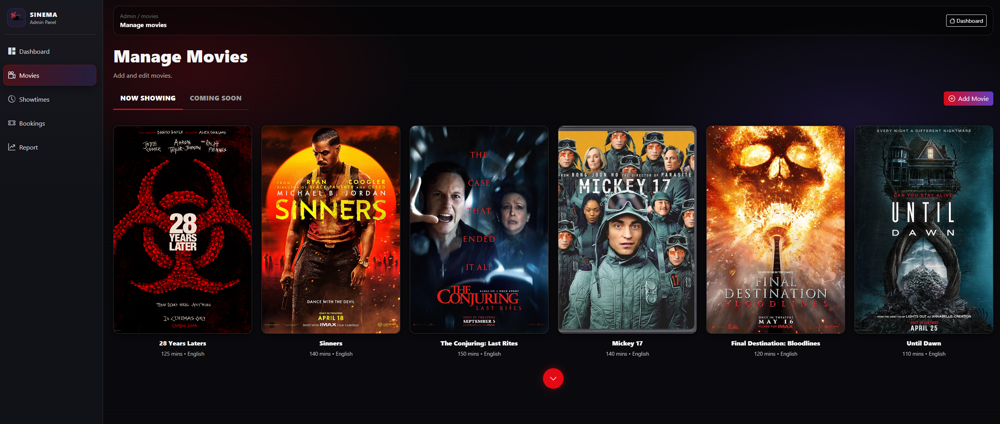
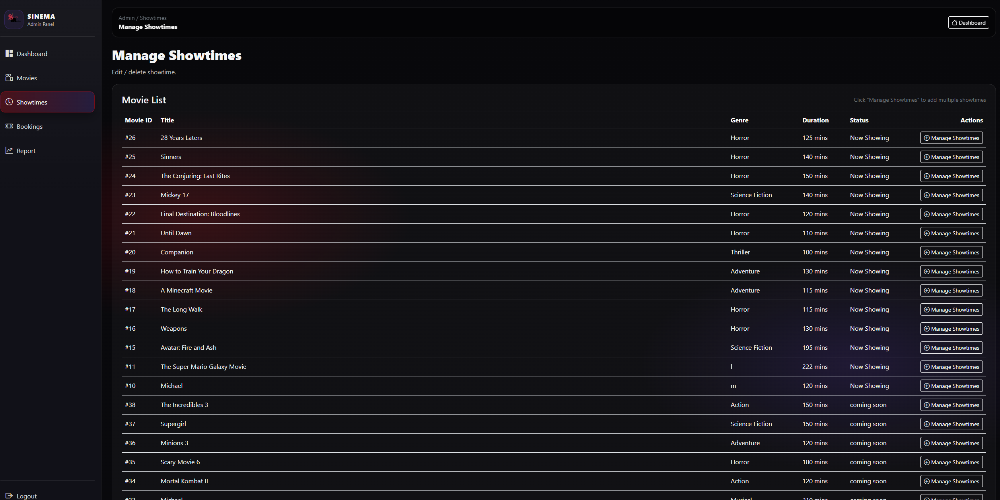
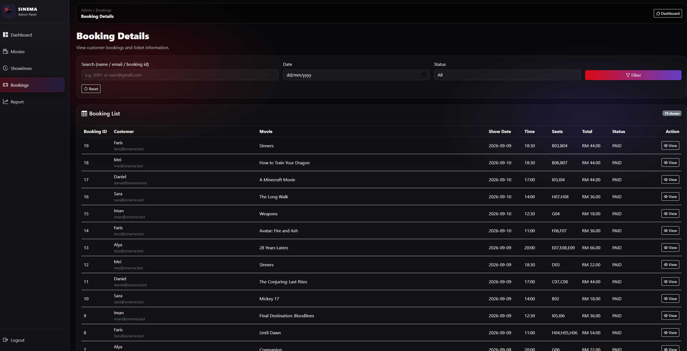
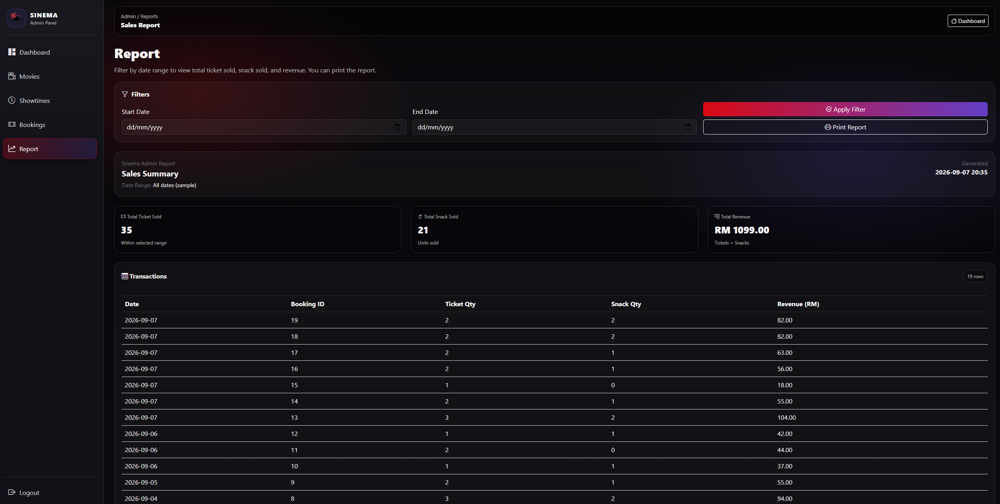

# 🎬 Sinema Movies


**Sinema Movies** is a cinema booking web application developed using **Java, Jakarta EE, JSP, Maven, Payara Micro, and MariaDB/MySQL**.

The system provides two main interfaces:

- **Customer side** — browse movies, select showtimes, choose seats, add snacks, and complete bookings.
- **Admin side** — manage movies and showtimes, monitor bookings, and view sales reports.

This project was originally developed as a university group project for **CSC584** and was later cleaned, reorganized, migrated to **Java 21**, and prepared for GitHub.

---

## ✨ Features

### 👤 Customer

- User registration and login
- Browse **Now Showing** and **Coming Soon** movies
- View movie information and available showtimes
- Interactive cinema seat selection
- Booked/unavailable seat indicators
- Select food and drinks
- Support multiple quantities of the same snack
- Order summary with ticket and snack totals
- Booking receipt after checkout

### 🛠️ Admin

- Separate admin authentication
- Admin dashboard
- Manage movie listings
- Add, update, and delete movies
- Manage movie showtimes
- View customer bookings
- Search and filter booking records
- Sales report
- Ticket, snack, and revenue summaries
- Transaction history

---

## 🖼️ Screenshots

### Customer Movie Dashboard



### Seat Selection



### Food & Drinks



### Checkout & Payment



### Admin — Manage Movies



### Admin — Manage Showtimes



### Admin — Booking Details



### Admin — Sales Report



---

## 🧰 Tech Stack

| Technology | Usage |
|---|---|
| Java 21 | Backend application logic |
| Jakarta EE 10 | Web application APIs |
| JSP | Server-side UI |
| HTML / CSS / JavaScript | Frontend |
| Bootstrap | UI components |
| Maven | Dependency and build management |
| Payara Micro | Jakarta EE application server |
| MariaDB / MySQL | Relational database |
| JDBC | Database connectivity |
| XAMPP | Local MariaDB/MySQL environment |

---

## 📁 Project Structure

```text
Sinema-Movies/
├── src/
│   └── main/
│       ├── java/
│       │   └── com/mycompany/sinema/
│       │       ├── controller/
│       │       ├── DAO/
│       │       ├── filter/
│       │       ├── model/
│       │       └── util/
│       │
│       ├── resources/
│       │   └── META-INF/
│       │
│       └── webapp/
│           ├── admin/
│           ├── images/
│           ├── user/
│           └── WEB-INF/
│
├── database/
│   └── sinema.sql
│
├── screenshots/
│   ├── logo.png
│   ├── dashboard.png
│   ├── seats.png
│   ├── snacks.png
│   ├── payment.png
│   ├── manage.png
│   ├── showtime.png
│   ├── bookings.png
│   └── report.png
│
├── pom.xml
├── .gitignore
└── README.md
